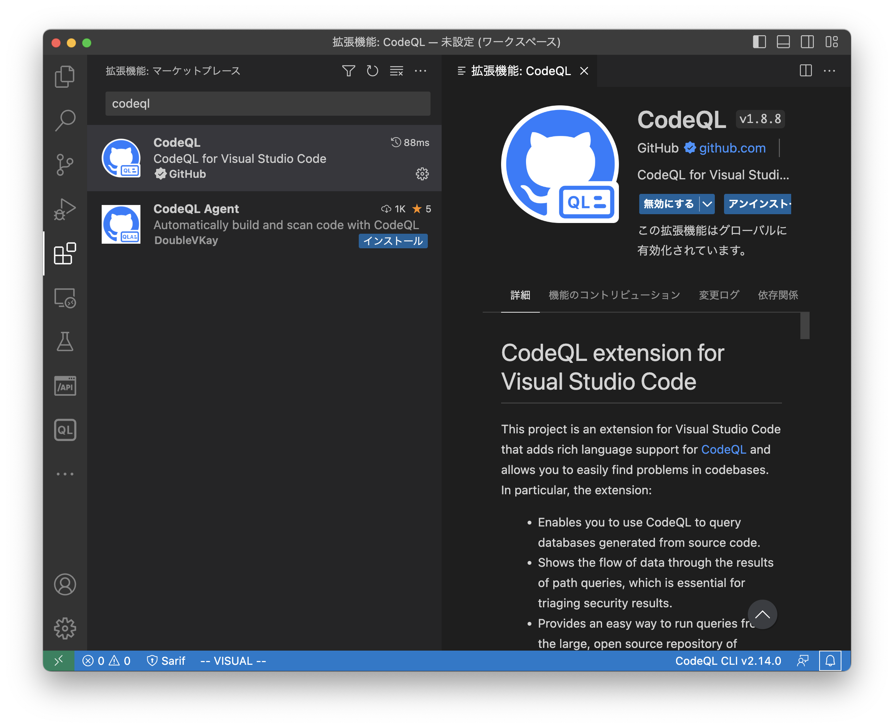
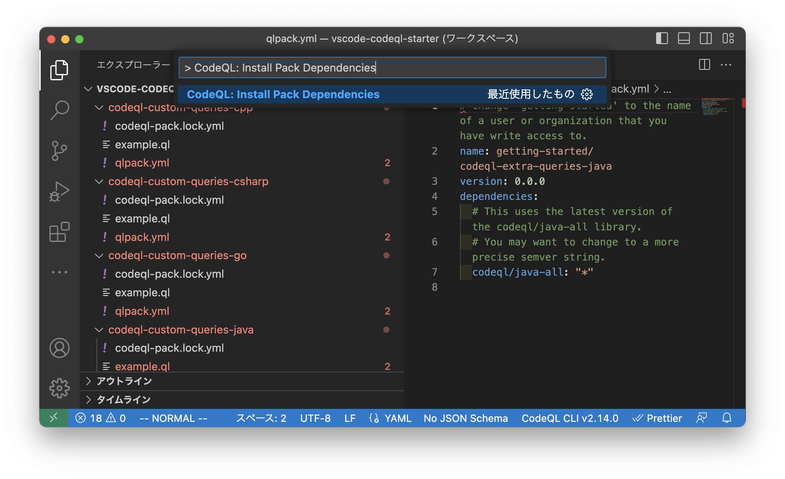
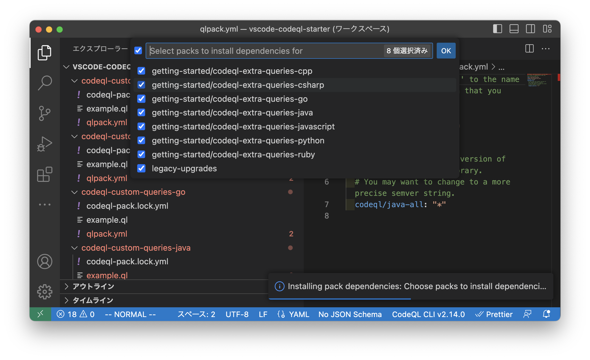
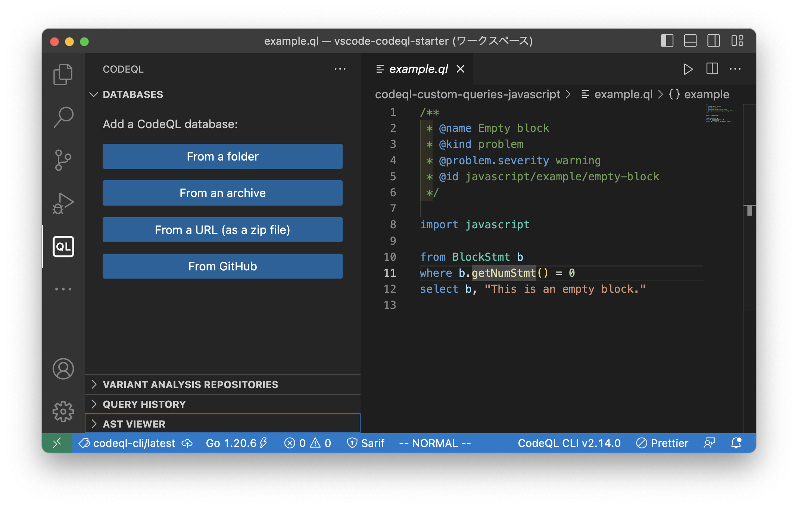
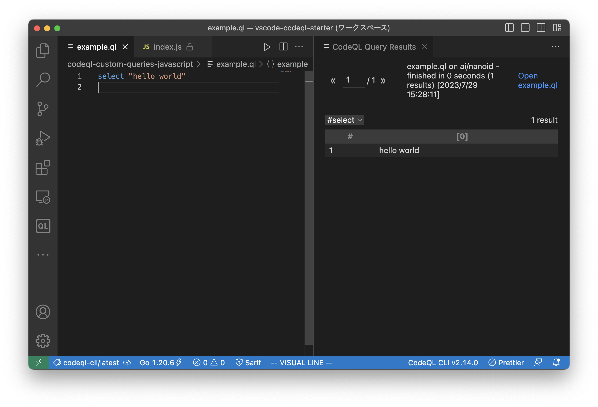
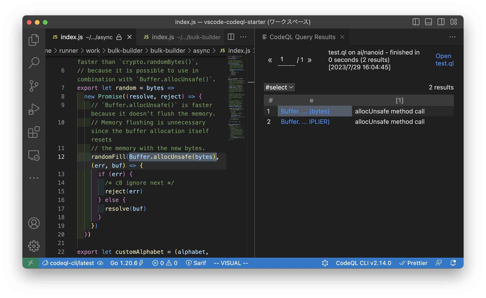

# 講義日程

8月10日(木) 8時30分～12時30分

# 講義概要

脆弱性を見つける上で、ソースコード解析のスキルがあれば実装を理解したうえで効率的な脆弱性調査が可能です。
また、脆弱性の原因となった実装について分析することで、開発時にそのような脆弱性を作り込まないよう活かすことが可能です。
本講義では手動のソースコード解析に加えて、CodeQL等の静的解析ツールをOSSのWebアプリケーションに用いることで、脆弱性の検出を効率的に行う方法をハンズオン形式で学びます。

# 事前課題

## 1\. Webセキュリティ基礎系

講義中にXSS, SSRF, Log4Shell(CVE-2021-44228)について取り上げる予定です。
もう知ってるよという方はスルーしてもらって大丈夫ですが、ある程度概要を把握していることを前提に進めるので、知らない方は調べてみてください。
可能であれば実際にこれらの脆弱性のあるサーバを動作させて、手元で動作検証を行ってみるとより理解が深まると思います。
分からないことがあればDiscordでお気軽にどうぞ！

参考資料

* XSS資料 https://portswigger.net/web-security/cross-site-scripting
* SSRF資料 https://portswigger.net/web-security/ssrf
* Log4Shell https://www.lunasec.io/docs/blog/log4j-zero-day/
  （もう少しいい参考資料がないかちょっと探し中...）

## 2\. 事前にインストールしておいてほしいもの

講義では以下のツールを利用する予定なので、インストールをお願いします。

* CodeQL CLI
  * https://github.com/github/codeql-cli-binaries
  * https://docs.github.com/ja/code-security/codeql-cli
* VSCode
* VSCode Sarif Viewer Extension
  * https://marketplace.visualstudio.com/items?itemName=MS-SarifVSCode.sarif-viewer
* Docker

## 3\. マシンスペックについての質問

当日使用予定のCodeQLはそこそこのマシンスペックが要求されます。
https://docs.github.com/en/code-security/code-scanning/automatically-scanning-your-code-for-vulnerabilities-and-errors/recommended-hardware-resources-for-running-codeql
持ってくるノートパソコンに搭載されているRAMの容量が16GB未満の方は、搭載されているRAMの容量とCPUをDiscordで教えてください。
(GitHub Codespacesで代替するか等考えます。)

## (7/31追加) 4. CodeQLクエリを書くための初期設定

VS Code拡張を今回は利用するため、以下の手順での初期設定をお願いします。
[Setting up CodeQL in Visual Studio Code](https://codeql.github.com/docs/codeql-for-visual-studio-code/setting-up-codeql-in-visual-studio-code/)

手順が色々とあるので動画も参考にどうぞ
<iframe width="560" height="315" src="https://www.youtube.com/embed/FwWNX-dDl74" title="YouTube video player" frameborder="0" allow="accelerometer; autoplay; clipboard-write; encrypted-media; gyroscope; picture-in-picture; web-share" allowfullscreen></iframe>

1. Step1. VS CodeにCodeQL Extensionをインストール
   https://marketplace.visualstudio.com/items?itemName=GitHub.vscode-codeql



2. Step2. vscode-codeql-starter リポジトリを git clone

```
$ git clone https://github.com/github/vscode-codeql-starter
```

3. Step3. リポジトリのsubmoduleをダウンロード

```
$ cd vscode-codeql-starter
$ git submodule update --init --remote
```

4. Step4. VS Codeで `File > Open Workspace` からフォルダ内の `vscode-codeql-starter.code-workspace` を選択
   (日本語だと `ファイル > ファイルでワークスペースを開く`)

5. Step5. CodeQL CLIがインストールされてない場合、適当に `codeql-custom-queries-javascript/example.ql` とかを開くとインストールが始まる
   (Linux arm64環境の人は降ってくるJavaを差し替える必要があるかも...)

6. Step6. VS Code Command `CodeQL: Install Pack Dependencies` を実行して、CodeQLの公式ライブラリをインストール





7. Step7. `codeql-custom-queries-javascript/example.ql` 等を開いてエラーが起きている場合には VS Code Command `Reload Window` を実行

これでセットアップは完了です！

## (7/31追加) 5. 簡単な動作確認

実際にCodeQLでソースコードで検索が行えるか試してみましょう。

ここでは試しに、nanoidという小さいライブラリを利用して、クエリを実行してみます
nanoid: ランダムなIDを生成するライブラリ

1. Step1. サイドバーのCodeQL拡張を選択し、　 `DATABASES > From GitHub` で `https://github.com/ai/nanoid` を入力しデータベースをダウンロード



2. Step2. `codeql-custom-queries-javascript` ワークスペースに `test.ql` を作成

test.ql

```
select "hello world"
```

3. Step3. VS Code Command `CodeQL: Run Query on Selected Database` を実行

4. Step4. `hello world` が `CodeQL Query Results` に表示される



5. Step5. `test.ql` を書き換え (これがどういったものなのかはまた講義中に解説します！)

test.ql

```
import javascript

from MethodCallExpr e
where e.getMethodName() = "allocUnsafe"
select e, "allocUnsafe method call"
```

6. Step6. 実行すると `allocUnsafe` メソッドが呼び出される箇所が表示されます



余裕がある人は `https://github.com/misskey-dev/misskey` のデータベースを追加して `codeql-custom-queries-javascript/example.ql` を実行してみてください。

Misskeyのソースコードの中で、実行するものがない空のブロック（`{}`）があるか検索できます。
